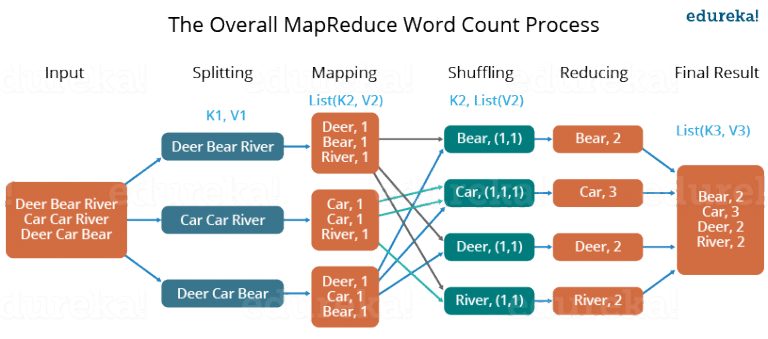

# Map Reduce

In this quick task we want you to write a node or Python application to **map reduce** data from a text file.

Use the file [Midsummer Nights Dream by William Shakespeare Download Here](data/a-midsummer-nights-dream.txt)

Ignore lines starting with;
* =

Ignore;
* https:// and all text after
* any non=alphanumeric characters

The steps for MapReduce are;
* Input of data
* Split the data into individual items, e.g. words.
* Mapping of items, duplication occurs, value of item is 1 for all items
* Shuffle.  This means to sort all items into adjacent ordering, so that all like items are next to each other.
* Reducing. This is where the count of duplicate items is performed
* Final output, each item is listed once with the number of occurrences.

Diagram of the phases:



## Requirement

Your code should provide a dictionary object of words all lowercase and the number of occurances.

You could apply the map reduce mechanism, or you could consider faster solutions, making use of how a dictionary can be used to perform map reduce data.

**NOTE:** There is a quick way to get the number of occurrences of each word in Python, so you can skip a sort phase, so some experimentation may be required, but we only have a short time.

## Optional 300+ task

Consider how to speed up the processing.

Could you split the file into a number of shards.  Perhaps make the number of shards an argument you can pass to the script, so that you can find out optimum timing.

Your script will need to bring all the data back together to provide a final view.

Make use of the **time** command to see if processing can be made faster.

Timing in Python;
```
from datetime import datetime
start_time = datetime.now()
# do your work here
end_time = datetime.now()
print('Duration: {}'.format(end_time - start_time))
```

Timing in JavaScript/node;
```
console.time('test');
//some code
console.timeEnd('test'); //Prints something like that-> test: 11374.004ms
```

Other options:
* Threading
* async
* Multi-process

See if splitting into parallel execution can speed up the process.